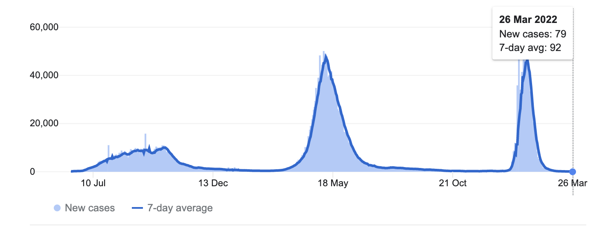
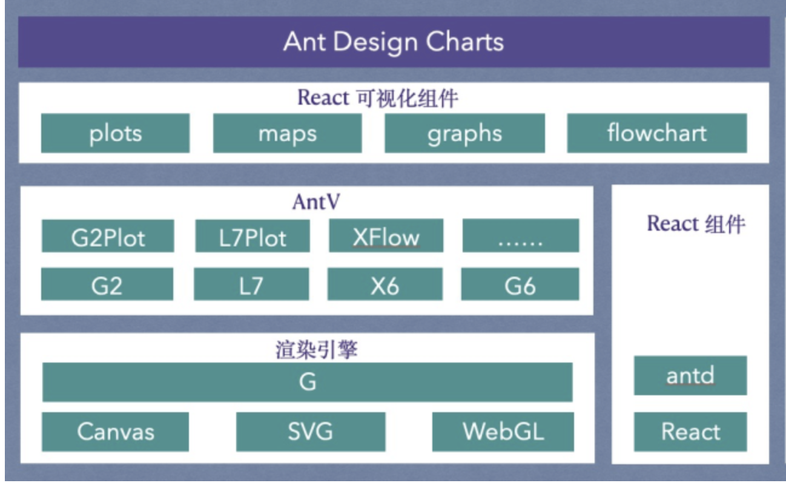

## Data Visualizations with React

Kiran Abburi

---

#

### What is Data Visualization?

Data visualization is the graphical representation of information and data using visual elements like charts, graphs, and maps.

---

Helps us understand trends and patterns faster

Example: Coronavirus stats chart

---

### Data Visualization Libraries

- D3
- Wrappers of D3
- React Wrappers of D3
- Config driven libraries
- Antv

---

# D3

- Pros
  - Well established with a large community
  - Provides low-level API to build almost any data visualization we need
- Cons
  - No out of the box support for basic charts
  - Huge learning curve
- Used by companies like New York Times, Datadog, Coinbase, Square

---

### D3 Wrappers

C3.js, DC.js

---

### React D3 Wrappers

Nivo, Recharts, VX, React-vis

---

### Config driven libraries

Echarts, highcharts

- Pros
  - Out of the box support for commonly used charts
  - Highly customizable with configuration
- Cons
  - No level API to implement features not supported by it
- Used by companies like [GitLab](https://about.gitlab.com/blog/2019/09/30/why-we-chose-echarts/), Amazon, Baidu

---

### AntV

- Pros
  - Full suite of tools for data visualization
  - Out of the box support for commonly used charts
- Cons
  - Need to use google translate for docs and other resources
- Used by Alipay, JD.com

---

### Ant Design Charts

Source: Ant Design Charts Docs

---

Why we choose Antv?

---

Rendering of charts

- SVG or Canvas

---

## SVG

- Pros
  - Data visualization will be responsive and scale well with the view size
  - Better accessibility
- Cons
  - This could result in poor performance for a large number of data points

---

## Canvas

- Pros
  - Good performance even with a large number of data points
- Cons
  - Don't scale well with the view size changes, need to re-draw.
  - Less accessible compared to SVG

---

## Best Practices

- Don’t render any data visualizations that are not in the user viewport.
- Use canvas instead of SVG for rendering data visualizations when there are a lot of data points
- Avoid unnecessary re-renders.

---

# Thank You
